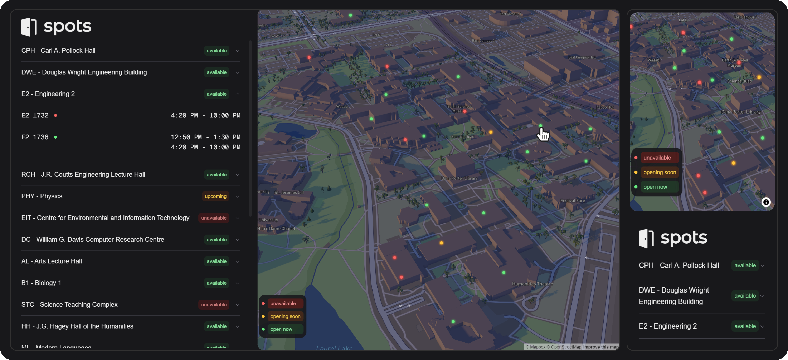

# PlugNear

**PlugNear** is a web application designed to help electric vehicle owners find charging stations across Ontario, Canada. When you're on the road and need to charge your EV, use **PlugNear** to locate available charging stations in real-time, offering convenient options for charging your vehicle.

## Features

-   Displays electric vehicle charging stations across Ontario, Canada.
-   Sorts charging stations based on proximity to the user's current location.
-   Provides real-time availability status of charging stations.
-   Interactive map to visualize charging station locations.
-   List view of charging stations with detailed connection information.
-   Shows charging connection types and power ratings.

## Tech Stack

### Frontend

-   **Next.js**: Handles server-side rendering and provides a robust React-based framework for building the frontend UI.
-   **Mapbox GL**: Provides the interactive map to display charging station locations across Ontario.
-   **Tailwind CSS**: Used for styling the UI components with utility-first CSS for responsive and consistent design.
-   **Geolocation API**: Retrieves the user's current location to sort charging stations by proximity.

### Backend

-   **Flask**: A lightweight Python web framework to handle API requests and logic for retrieving and processing charging station data.
-   **Requests**: A Python library used in Flask to fetch charging station data from the Open Charge Map API.
-   **Haversine Formula**: Implemented in the backend to calculate the distance between the user and charging station locations based on coordinates.

## API Integration

-   **Open Charge Map API**: Provides comprehensive data about EV charging stations worldwide, including location, connection types, power ratings, and availability status.

## Data Features

-   **Station Information**: Name, address, and town location
-   **Connection Details**: Charging connector types (Type 1, Type 2, CCS, CHAdeMO, etc.)
-   **Power Ratings**: Charging speed in kilowatts (kW)
-   **Availability Status**: Real-time operational status
-   **Distance Calculation**: Sorted by proximity to user location

## Future Enhancements

-   **User Authentication**: Allow users to log in and save favorite charging stations.
-   **Notifications**: Send alerts when charging stations become available or when you're near a station.
-   **Route Planning**: Integrate with navigation apps to plan routes with charging stops.
-   **Payment Integration**: Show pricing information and payment methods for each station.
-   **Reviews & Ratings**: Allow users to rate and review charging stations.
# PlugNear
# PlugNear
